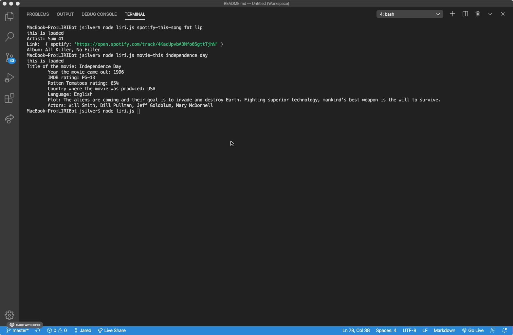

# LIRIBot

LIRI is a Language Interpretation and Recognition Interface.

---

## Overview

LIRI is a command line node app that takes in parameters and returns data.

---

## Assignment

Use Node.js to create LIRI bot that takes in the following commands:

- concert-this
- spotify-this-song
- movie-this
- do-what-it-says

---

## Programs and Files Used

- Node.js
- .env (Must include spotify keys in here)
- .gitignore (includes DS_Store, .env, node_modules)

APIs used:

- Spotify (https://developer.spotify.com/)
- OMDB (http://www.omdbapi.com)
- Bands In Town (http://www.artists.bandsintown.com/bandsintown-api)

NPM packages used:

- Node-Spotify-Api (https://www.npmjs.com/package/node-spotify-api)
- Axios (https://www.npmjs.com/package/axios)
- Moment (https://www.npmjs.com/package/moment)
- DotEnv (https://www.npmjs.com/package/dotenv)

---

## How It Works

1. node liri.js concert-this (artist name)

- Name of venue
- Venue Location
- Date of event

2. node liri.js spotify-this-song (song)

- Displays the following:
  - Artist(s)
  - Song name
  - Preview link
  - Album name

3. node liri.js movie-this (movie name)

- Displays the following:
  - Title
  - Year released
  - IMDB rating
  - Rotten Tomatoes Rating
  - Country where movie was produced
  - Language
  - Plot
  - Actors

4. node liri.js do-what-it-says
   - Runs spotify-this-song I Want it that Way.

---

## Instructions

- Run npm init
- Create a .gitignore
- Make a JavaScript file named keys.js
- Create a file named .env to hold your API keys
- Make a file called random.txt
- Make a JavaScript file name liri.js
- Run npm install

---

## Demo

